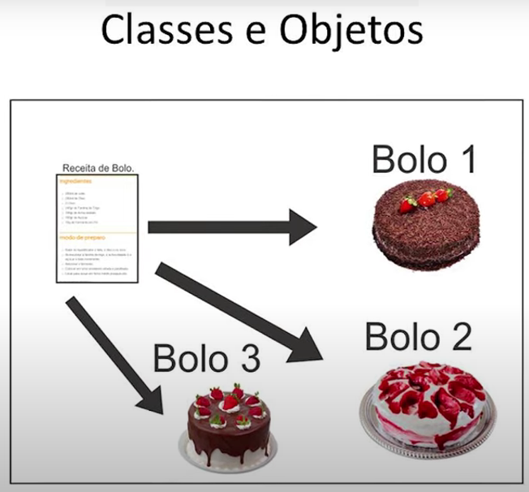
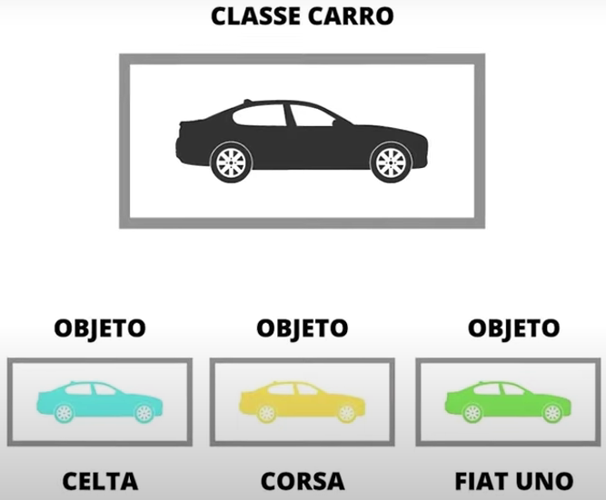
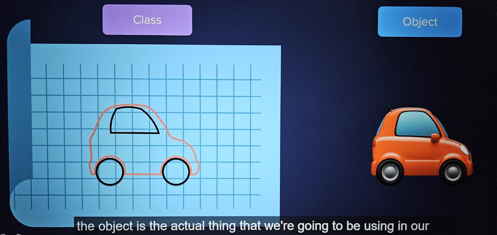
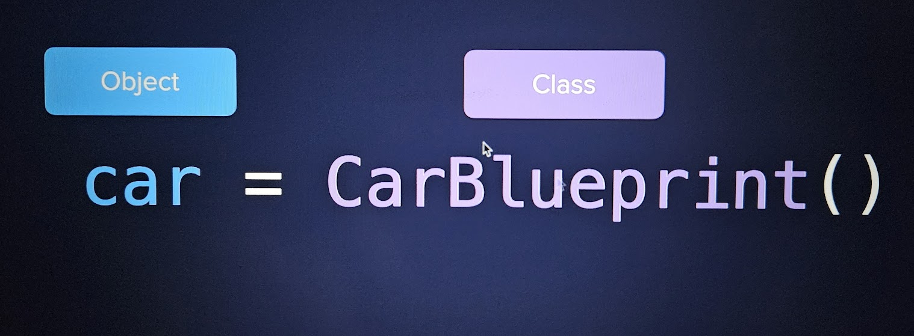
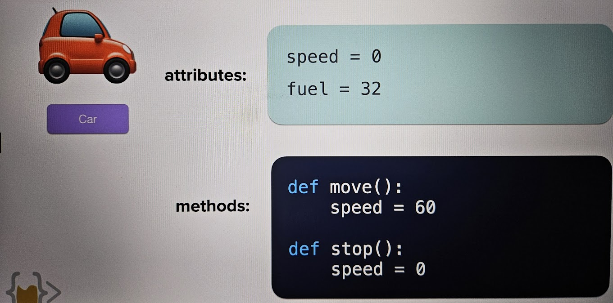
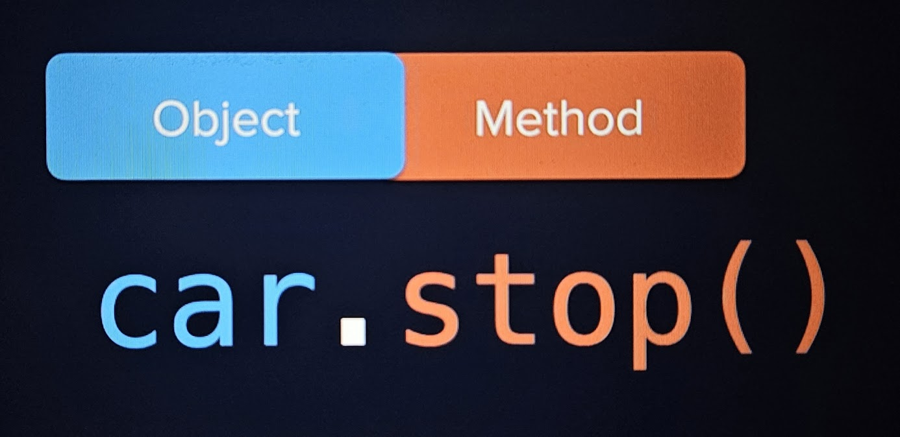

# Understanding OOP
It's called Object Oriented Programming because it is trying to model a real world object.
"Uma maneira de conseguir organizar seu código de uma forma melhor, mais escalável"
"Encapsular tudo que faz sentido para um contexto dentro de um objeto que consiga representar esse contexto"
For example, a "virtual restaurant" would have:
- A virtual Chef
- A virtual Waiter
- A virtual Cleaner
- A virtual Manager  

- Waiter Example:  
    - has - attributes (basically a variable associated with a modeled object)
    ```py
    is_holding_plate = True
    tables_responsible = [4,5,6]
    ```
    - does - **methods** (are functions, what an object can do)
    ```py
    def take_order(table, order):
        #takes order to chef
    def take_payment(amount):
        #add money to restaurant
    ```

## Example
Objeto: Bolo  
Classe: Receita do Bolo  


Objeto: Modelo do Carro
Classe: Carro  


Instâncias: Objeto criado através da Classe

## Examples





------

# Constructing Objects
